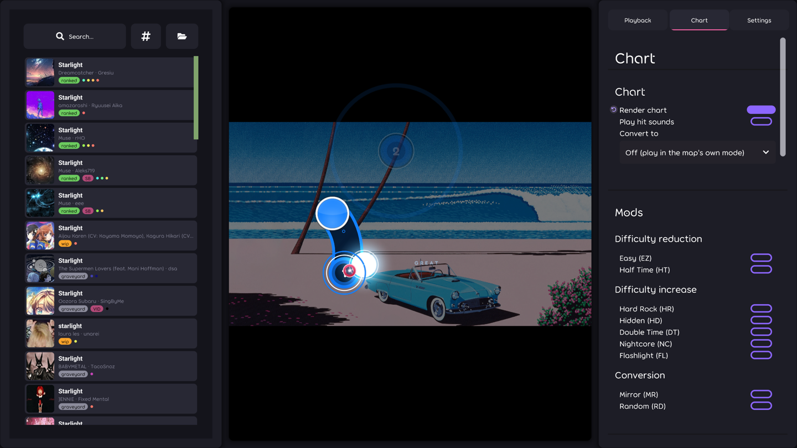
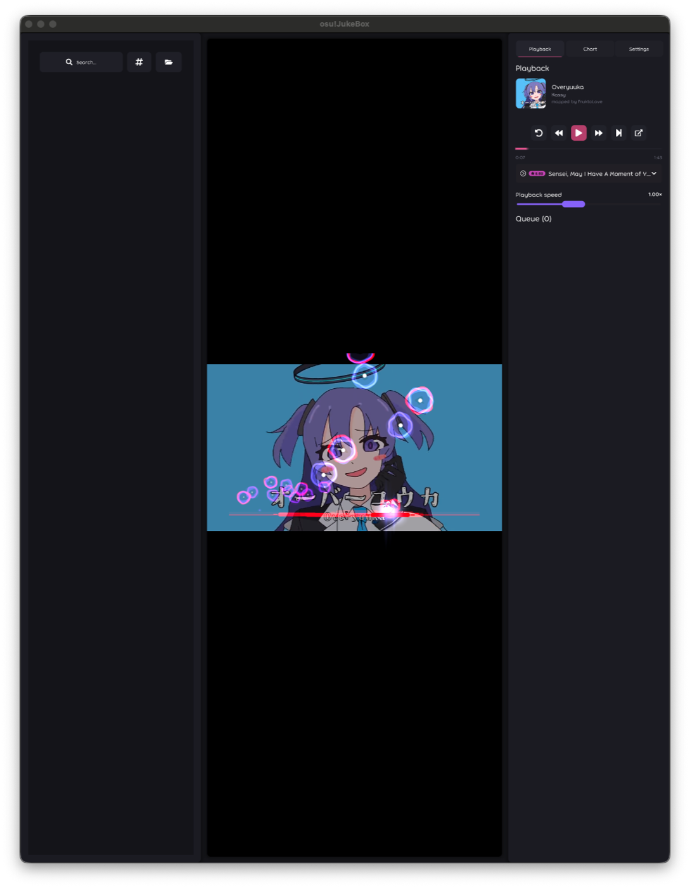
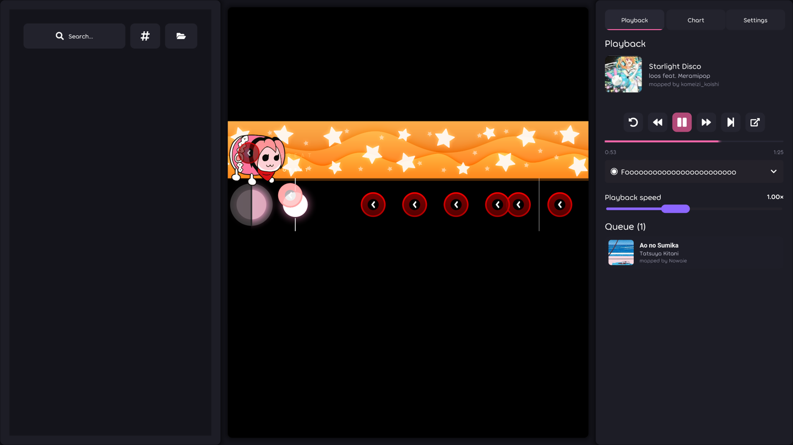

# osu!JukeBox

[](https://github.com/ST4RCHASER/osu-JukeBox/actions/workflows/test.yml)

A standalone music player for osu! beatmaps. Search for a map, queue it, and it plays the song with
the real thing attached — the beatmap's storyboard, its video, and its chart being played out in
front of you.

It does that by hosting **osu!lazer itself** as a library rather than reimplementing any of it, so a
storyboard, a slider or a mania stage looks the way it does in the game because it *is* the game's
renderer drawing it.



<table>
<tr>
<td></td>
<td></td>
</tr>
</table>

## Licensing, before you download

The **source** in this repository is MIT. The **published builds are not free for commercial use**,
because they bundle two components that forbid it:

- osu!'s default skin, samples and fonts (`osu-resources`) are **CC BY-NC** — non-commercial.
- **BASS**, the audio library, is free for non-commercial use only; commercial use needs a licence
  from un4seen.

Use it personally and freely. Don't ship it, or anything built from these binaries, commercially.
Full per-component detail, including the LGPL pieces, is in [docs/ATTRIBUTION.md](docs/ATTRIBUTION.md).

osu!JukeBox is an unofficial fan project, not affiliated with or endorsed by ppy Pty Ltd.

## Features

- **Search and queue** — osu!'s own API when you supply credentials, or public mirrors when you
  don't. Drag queue entries to reorder, or jump straight to one.
- **All four rulesets**, plus conversion: play an osu! map as taiko, catch or mania (including
  per-key-count mania), the same way lazer converts them.
- **Mods** — the difficulty-changing ones, rate mods, mirror and random.
- **Playfield element toggles** — turn off the cursor, judgements, hit lighting, follow points and
  the rest, per element, if you want to watch the map rather than the effects.
- **Storyboards and videos**, including beatmap-supplied ones.
- **Legacy skins** — import a `.osk` and charts render with it.
- **Replays** — drop a `.osr` and it plays that difficulty back with the mods the player used.
- **Detached player window** — put the visuals on a second display while the controls stay put.
- **Per-map audio offsets**, playback speed, and a background dim/blur.

## Install

Grab a build from the [Releases page](https://github.com/ST4RCHASER/osu-JukeBox/releases).

| Platform | What you get |
| --- | --- |
| Windows | A single `.exe`. Run it. |
| Linux | A single binary in a `.tar.gz`. Extract, `chmod +x`, run. |
| macOS (Apple Silicon) | A `.dmg`. Drag to Applications. |

The macOS build is **unsigned**, so Gatekeeper will refuse it on first launch — that is expected and
there is a one-time way around it: see [docs/macos-first-launch.md](docs/macos-first-launch.md).

## Build from source

Needs the [.NET 10 SDK](https://dotnet.microsoft.com/download).

```sh
git clone https://github.com/ST4RCHASER/osu-JukeBox.git
cd osu-JukeBox
dotnet run --project JukeBox.Desktop
```

Tests:

```sh
dotnet test
```

On a headless Linux machine the test host needs an audio device to exist and a display to open, so
install `libasound2t64` and run the suite under `xvfb-run` — see
[`.github/workflows/test.yml`](.github/workflows/test.yml), which does exactly that.

## How it works

The split is deliberate: anything osu! already solves is delegated to osu!lazer, and this project
supplies everything around it.

- **`JukeBox.Game/LazerPlayer/`** — hosts lazer's `DrawableRuleset`, `DrawableStoryboard` and video
  layers against our own clock, and feeds them beatmap folders instead of lazer's realm-backed
  storage. Chart mods, mode conversion and skin resolution live here.
- **`JukeBox.Game/Online/`** — beatmap search and downloads: osu!'s API or a chain of mirrors, with
  per-mirror health tracking so a dead one is skipped rather than retried forever.
- **`JukeBox.Game/Playback/`** — the queue, the radio that picks something when the queue empties,
  and the playback controller every visual layer is driven from.
- **`JukeBox.Game/UI/` and `Screens/`** — the three-column interface.
- **`JukeBox.Desktop/`** — the entry point, and the second process the detached player runs in.

## Credits

- **[ppy/osu](https://github.com/ppy/osu)** — osu!lazer, whose gameplay, storyboard and video
  renderers this project hosts. MIT, Copyright (c) ppy Pty Ltd.
- **[ppy/osu-framework](https://github.com/ppy/osu-framework)** — the framework it all draws with.
  MIT, Copyright (c) ppy Pty Ltd.
- **[ppy/osu-resources](https://github.com/ppy/osu-resources)** — default skin, samples and fonts.
  CC BY-NC 4.0.
- Beatmap mirrors: **[NeriNyan](https://nerinyan.moe/)**, **[catboy.best](https://catboy.best/)**
  and **[osu.direct](https://osu.direct/)**.
- **[BASS](https://www.un4seen.com/)** by un4seen developments, for audio.

Beatmaps, skins, audio, art and storyboards belong to their creators — this project only plays them.
